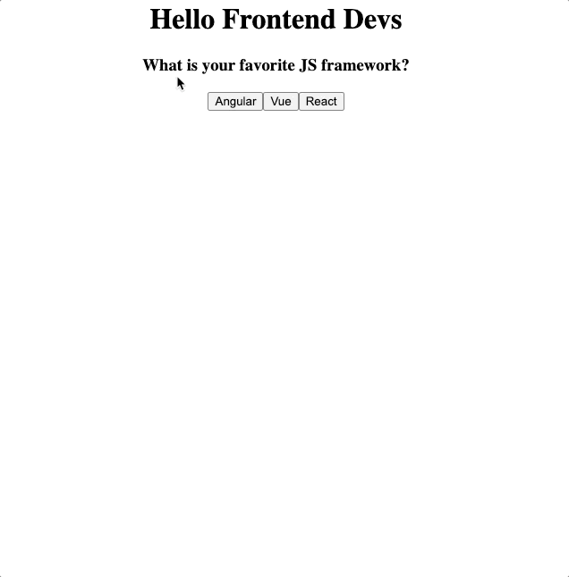

# Framework Picker

Build a component that prompts the user to select their favorite JavaScript framework.

Give them 3 buttons to click: Angular, Vue, and React. When they click a button, a short message should appear along with the logo of the selected framework

> **Toolbox**: For this project you should use
>
> - Component data
> - Text interpolation
> - Component methods & event handling
> - Conditional rendering with `v-if`
> - Attribute binding

#### Stuck?

Need help? Try the [Code by Numbers](./Session_1E_CBN.md)
