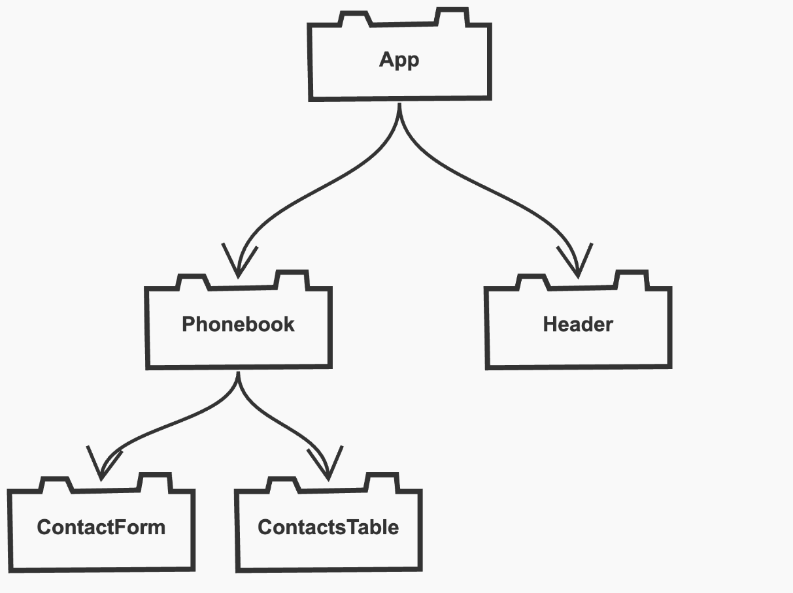
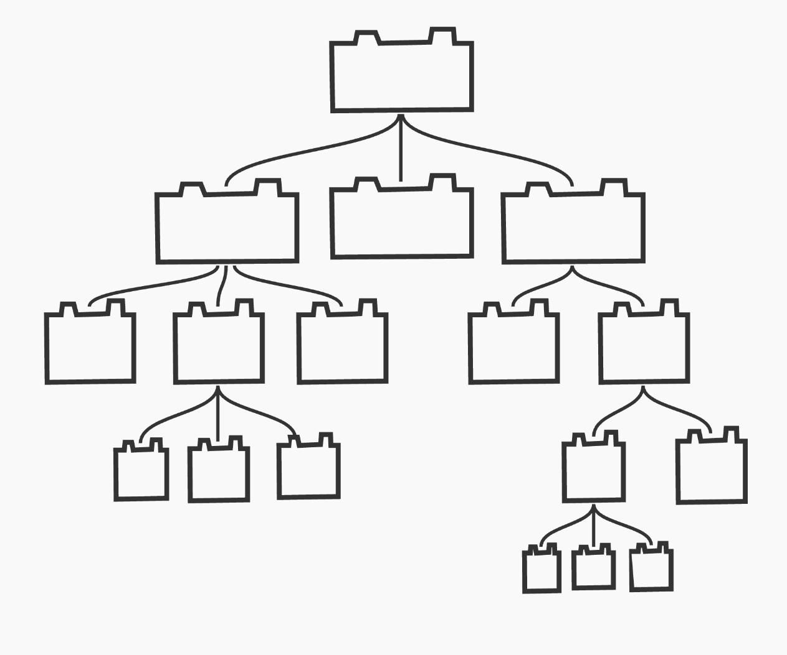
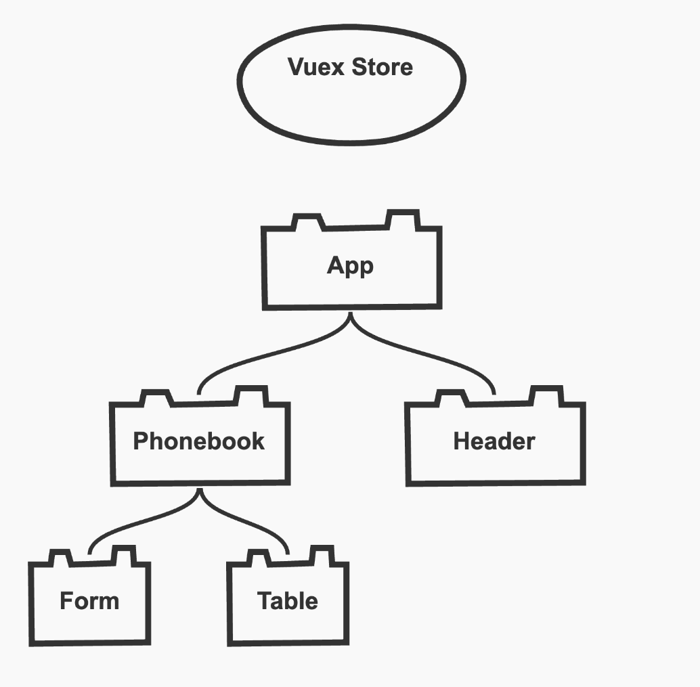

> **NOTE**: This chapter has prerequisites
>
> - [Simplify promises with async/await (1/2)](https://www.youtube.com/watch?v=Yp9KIcSKTNo)
> - [Simplify promises with async/await (2/2)](https://www.youtube.com/watch?v=tc8DU14qX6I)
> - [How to store API keys in Environment Variables](https://medium.com/js-dojo/how-to-use-environment-variables-in-vue-js-273eba0102b0)

[](https://vuejs.org/v2/guide/syntax.html#Text)
[](https://vuejs.org/v2/guide/list.html)
[](https://vuex.vuejs.org/guide/state.html)
[](https://vuex.vuejs.org/guide/mutations.html)
[](https://vuex.vuejs.org/guide/actions.html)
[](https://vuex.vuejs.org/guide/getters.html)

# Movie Vuer

In this chapter we're going to look at another way to manage state in our application. We'll explore a state management pattern called **Vuex** while we build a movie searching app. Users of the app will be able to search for movies by title and see a list of matches. Clicking a movie in the search results will display details about the selected movie along with reviews.

A demo of this application can be seen [here](https://nss-vue-movie-vuer.web.app)

> **Learning Objectives**: By the end of this chapter you should be able to
>
> - Describe at a high level the pros and cons of using Vuex
> - Know what to look for when deciding whether or not to use Vuex
> - Understand the parts of a Vuex store (state, mutations, actions, and getters)
> - Access a Vuex store from a component

# Why Vuex

The apps we've built so far have fairly simple component trees, which has made managing state relatively easy. As a reminder, here's a look at the component tree we had in our Phonebook application



We saw how we can have components communicate with each other. Parent components can **pass data down via props** and children components can **emit events up** to talk to parents. However there is no mechanism for sibling components to conveniently communicate. Say for example we wanted the `Header` component to display the total number of contacts in our phonebook. That state lives in the `Phonebook` component which is its sibling. The only way to fix this would be to lift the array of contacts up one level into the `App` component. The fallout from this means that when the `ContactForm` emits the submit event, the `Phonebook` component has to emit _another_ event to tell the `App` component to add the new contact. This is starting to sound pretty annoying and it's only 3 levels deep. Imagine a component tree that looks like this



With a component tree like this, if a low level component wanted to update a piece of state that was located at the top of the tree it'd be incredibly tedious.

This is where **Vuex** comes in. The Vuex pattern is a different paradigm where we take state that will be shared among many components (i.e. a currently logged in user) and move it to a javascript module that is not part of the component tree. We call this module a **store**



The great thing about this pattern is that components at _any_ level can communicate directly with the Vuex store. This greatly reduces the possibility of having to emit events many levels up, as well as having to pass state many levels down--a problem commonly referred to as "prop drilling"

## Project setup

1. `cd` into the directory you'd like to add your new project and run

```sh
vue create movie-vuer
```

|           prompt           |            answer             |
| :------------------------: | :---------------------------: |
|           Preset           |   Manually select features    |
|      Features needed       | Babel, Vuex, Linter/Formatter |
|       Linter config        |       ESLint + Prettier       |
|    Additional lint feat    |         Lint on save          |
| Config location preference |   In dedicated config files   |
|       Save as preset       |               N               |

2. Add the Vuetify library and choose the `Default` preset

```sh
vue add vuetify
```

3. Remove the boilerplate code in `App.vue`

4. Register for a new API key from The Movie Database [here](https://www.themoviedb.org/signup)

5. Create a `.env.local` file at the root of the Vue project with the following and add your API key

```
VUE_APP_MOVIE_API_KEY=xxxxxxxxxxxxxxxxxxxxx
```

## Examining the Vuex store

> **NOTE**: If you don't have a `/store` directory in your project, you may have forgotten to tell the Vue CLI that you wanted Vuex when you ran `vue create movie-vuer`. If that's the case, you can still add Vuex to your existing project by running `vue add vuex`

If we look at the `index.js` file inside the `store` directory we can see what an empty Vuex store looks like. The first thing to do is to think about all the shared state we want to include in the store. We can start with these items

- A string for holding what the user has searched for
- An array of movies that matched the search term
- An object representing the details of the movie that was selected
- An array of comments related to the selected movie

## Adding dummy data to the store

We can hard code some fake data for starters and get it into the `state` object so we can begin to see how components can consume it. Create a file named `FAKE_DATA.js` in the `store` directory and copy in the fake API data from the file linked below

[Fake Movie Data](../assets/fake_movie_data.js)

We need to add initial values for all of these pieces of state. For now, use the fake data for the search results and the movie details

```js
import Vue from "vue";
import Vuex from "vuex";

// TODO: Delete this later
import { FAKE_SEARCH_RESULTS, FAKE_MOVIE_DETAILS } from "./FAKE_DATA";

Vue.use(Vuex);

export default new Vuex.Store({
  state: {
    searchTerm: "home alone",
    searchResults: FAKE_SEARCH_RESULTS,
    movieDetails: FAKE_MOVIE_DETAILS,
    reviews: [],
  },
  mutations: {},
  actions: {},
  modules: {},
});
```

This state now lives in the store and can be accessed from all components at any level.

## Building a SearchResults component

Lets make a component to display our search results and add it to the app. Make a file named `SearchResults.vue` in the `components` directory. We'll style this with some Vuetify components in a later step, but for now lets just get the data on the screen

```vue
<template>
  <div v-if="searchTerm">
    <h3>
      Found {{ searchResults.total_results }} results for "{{ searchTerm }}"
    </h3>
    <div v-for="movie in searchResults.results" :key="movie.id">
      {{ movie.title }}
    </div>
  </div>
</template>

<script>
import { mapState } from "vuex";

export default {
  computed: {
    ...mapState(["searchResults", "searchTerm"]),
  },
};
</script>
```

This is how simple it is for a component to access the Vuex store. We import the `mapState` function with takes an array of property names we want to import from the store's state object. We can then spread those properties onto our `SearchResults` component.

Notice we add these properties into the component's **computed** section and not the component's **data**. The reason for this is that a component's **data** can be modified by the component, whereas the **computed** properties are readonly. This is desired because components should never be _directly_ modifying the state in the store. In order to do such a thing they have to use mutations and actions which we'll later define back in the Vuex store.

Update `App.vue` to use the new `SearchResults` component

```vue
<template>
  <v-app>
    <v-app-bar app color="red darken-1" dark> </v-app-bar>

    <v-main>
      <v-container>
        <search-results />
      </v-container>
    </v-main>
  </v-app>
</template>

<script>
import SearchResults from "./components/SearchResults";

export default {
  components: {
    SearchResults,
  },
};
</script>
```

Go back to the `SearchResults` component to add some styling. We can use Vuetify's `v-slide-group` component to add a nice looking side scroller

```html
<template>
  <v-sheet v-if="searchTerm" elevation="1" class="mx-auto" max-width="1000">
    <h3 class="pl-5 mt-5">
      Found {{ searchResults.total_results }} results for "{{ searchTerm }}"
    </h3>

    <v-slide-group class="pb-5" show-arrows>
      <v-slide-item v-for="movie in searchResults.results" :key="movie.id">
        <v-img
          contain
          :src="`https://image.tmdb.org/t/p/w200${movie.poster_path}`"
          height="200"
          width="150"
        ></v-img>
      </v-slide-item>
    </v-slide-group>
  </v-sheet>
</template>
```

> **NOTE**: The movie object's `poster_path` property doesn't contain an absolute URL. We need to append it to a base URL which includes a desired width as part of the path. In the example above the `/w200` in the URL is requesting an image 200px wide. To read more about this, look at the [Movie Database API Docs](https://developers.themoviedb.org/3/getting-started/images)

## Creating a header component with search

We'll put our search bar in the top header. It'll be best to make this into its own component. Make an `AppHeader.vue` file in the `components` directory. We'll add some Vuetify components and styling later but for now let's get a simple input field on the screen

```vue
<template>
  <v-app-bar app color="red darken-1" dark>
    <h1>Movie Vuer</h1>
    <form @submit.prevent="handleSubmit" style="background: white">
      <input type="text" v-model="query" />
    </form>
  </v-app-bar>
</template>

<script>
export default {
  data() {
    return {
      query: "",
    };
  },
  methods: {
    handleSubmit() {
      console.log("Search for:", this.query);
    },
  },
};
</script>
```

You might be wondering why we're using **data** here. After all, **data** is _state_ and isn't that what our store is for?

Components can still hold their own state. It's only the state that needs to be shared across lots of components that we tend to put in our store. The strategy here will be for the `AppHeader` component to wait until the user hits `Enter` and then alert the store to update `state.searchTerm` with whatever is in the textbox.

## Mutating state in the store

For components to change state in the store they have to use either **mutations** or **actions**. Let's start by looking at mutations.

Mutations are, at their simplest, just methods that update state. If we needed to add any logic in these we could, however for our purposes these methods will simply look like this

```js
mutations: {
  setSearchTerm(state, payload) {
    state.searchTerm = payload;
  },
  setSearchResults(state, payload) {
    state.searchResults = payload;
  },
  setMovieDetails(state, payload) {
    state.movieDetails = payload;
  },
  setMovieReviews(state, payload) {
    state.reviews = payload;
  }
}
```

Mutation methods will take a `state` and `payload` parameter. `state` is the current state object from the store. `payload` is whatever the caller of the method wants the new value to be. If this is confusing, it might make more sense when we see how to invoke these methods later.

There is a rule for mutations methods:

**Mutation methods _must_ be synchronous**

We cannot do anything asynchronous like making a `fetch` request for some data and then updating state. If you need to do something asynchronous (as we often do), we need to do those in **actions**

## Defining asynchronous actions

When our user searches for a movie title and hits `Enter` we need to make a `fetch` call to the Movie API and update `state.searchResults` with the response. Since this process is asynchronous, we have to define it in a Vuex action.

Actions are similar to mutations, the differences being that:

- Instead of mutating the state, actions commit mutations.
- Actions can contain arbitrary asynchronous operations.

Update the `actions` object in the store to the following

```js
actions: {
  async searchMovies({ commit }, payload) {
    const apiBaseUrl = "https://api.themoviedb.org/3";
    const apiKey = process.env.VUE_APP_MOVIE_API_KEY;
    const url = `${apiBaseUrl}/search/movie?query=${payload}&api_key=${apiKey}`;

    const res = await fetch(url);
    const data = await res.json();
    commit("setSearchTerm", payload);
    commit("setSearchResults", data);
  }
},
```

We've defined an action named `searchMovies` which is doing an asynchronous fetch call. Actions take two parameters. The first parameter is an object which we destructure the `commit` function from. With this `commit` function our action can call our mutations. The second parameter is once again a payload object. Eventually our `AppHeader` component is going to call this `searchMovies` method and it's going to need to pass it a string for a movie title.

## Dispatching actions from a component

For our components to get access to our Vuex actions, we can use the handy `mapActions` function. Update `AppHeader.vue`

```js
import { mapActions } from "vuex";

export default {
  data() {
    return {
      query: "",
    };
  },
  methods: {
    ...mapActions(["searchMovies"]),

    handleSubmit() {
      console.log("Search for:", this.query);
      this.searchMovies(this.query);
    },
  },
};
```

It behaves just like the `mapState` function we used before except we want to spread actions in our component's methods. Try running the application and searching for a movie title.

## How did we get here?

There are a lot of players involved in this Vuex pattern so let's review how this search feature works.

1. When the search form is submitted, the `AppHeader` component **dispatches the searchMovies action**
1. The `searchMovies` action makes a fetch call to the Movie API. When the data comes back it **commits the setSearchResults mutation**
1. The mutation updates the `searchResults` property of state
1. Since the `SearchResults` component has mapped the Vuex state to its own properties, it automatically re-renders.

## Styling the header

Update the `AppHeader` component to use some nicer looking Vuetify components

```html
<template>
  <v-app-bar app color="red darken-1" dark>
    <v-row justify="space-between" align="center">
      <v-col :sm="6">
        <div class="d-flex align-center">
          <h1>Movie Vuer</h1>
        </div>
      </v-col>

      <v-col :sm="2" class="mt-5">
        <form @submit.prevent="handleSubmit">
          <v-text-field
            v-model="query"
            dense
            rounded
            filled
            placeholder="Search movie titles"
            background-color="red lighten-2"
            prepend-inner-icon="mdi-magnify"
          ></v-text-field>
        </form>
      </v-col>
    </v-row>
  </v-app-bar>
</template>
```

## Selecting a title

When a user clicks on one of the posters in the search results we want to display some details about the movie as well as reviews. We'll need to make two fetch calls for this--one for the details and another for the reviews. Since this will be an async operation, we'll define an action to do this. Add the following action to the Vuex store

```js
async selectMovie({ commit }, movie) {
  const apiBaseUrl = "https://api.themoviedb.org/3";
  const apiKey = process.env.VUE_APP_MOVIE_API_KEY;
  const movieDetailsUrl = `${apiBaseUrl}/movie/${movie.id}?api_key=${apiKey}`;
  const movieReviewsUrl = `${apiBaseUrl}/movie/${movie.id}/reviews?api_key=${apiKey}`;

  // get movie details
  const detailsRes = await fetch(movieDetailsUrl);
  const details = await detailsRes.json();
  commit("setMovieDetails", details);

  // get movie reviews
  const reviewsRes = await fetch(movieReviewsUrl);
  const reviewData = await reviewsRes.json();
  commit("setMovieReviews", reviewData.results);
}
```

Now in our `SearchResults` component we can access this action and call it whenever a user clicks on the poster image. Update the script

```vue
<script>
import { mapState, mapActions } from "vuex";

export default {
  computed: {
    ...mapState(["searchResults", "searchTerm"]),
  },
  methods: {
    ...mapActions(["selectMovie"]),
  },
};
</script>
```

...and update the image tag in the template to handle the click

```html
<v-img
  @click="selectMovie(movie)"
  contain
  :src="`https://image.tmdb.org/t/p/w200${movie.poster_path}`"
  height="200"
  width="150"
></v-img>
```

You should now be able to confirm inside the Vue/Vuex devtools that the store's `movieDetails` state property is being updated every time the user clicks on a poster.

## Creating a Movie Details component

Add a `MovieDetails.vue` file to the `components` directory. The component will need to map the `movieDetails` property from the Vuex state. Once again, we'll worry about styling in a bit. Let's start by dumping some data on the page.

```vue
<template>
  <div v-if="movieDetails">
    <p>{{ movieDetails.title }}</p>
    <p>{{ movieDetails.backdrop_path }}</p>
    <p>{{ movieDetails.runtime }}</p>
    <p>{{ movieDetails.release_date }}</p>
    <p>{{ movieDetails.overview }}</p>
    <ul>
      <li v-for="genre in movieDetails.genres" :key="genre.id">
        {{ genre.name }}
      </li>
    </ul>
  </div>
</template>

<script>
import { mapState } from "vuex";

export default {
  computed: {
    ...mapState(["movieDetails"]),
  },
};
</script>
```

Now use the component in `App.vue`

```vue
<template>
  <v-app>
    <app-header />
    <v-main>
      <v-container>
        <search-results />
        <v-row class="mt-6">
          <v-col :sm="12" :md="6">
            <movie-details />
          </v-col>
          <v-col :sm="12" :md="6">
            <!-- Todo: REVIEWS GO HERE -->
          </v-col>
        </v-row>
      </v-container>
    </v-main>
  </v-app>
</template>

<script>
import AppHeader from "./components/AppHeader.vue";
import MovieDetails from "./components/MovieDetails.vue";
import SearchResults from "./components/SearchResults";

export default {
  components: {
    SearchResults,
    AppHeader,
    MovieDetails,
  },
};
</script>
```

If we run the app and click around we should see the movie details update to the selected title. Before we finish up and add the reviews let's add some Vuetify magic to the `MovieDetails` template

```html
<template>
  <v-card v-if="movieDetails">
    <v-img
      :src="`https://image.tmdb.org/t/p/w500${movieDetails.backdrop_path}`"
    ></v-img>
    <v-card-title color="red">{{ movieDetails.title }}</v-card-title>
    <v-card-subtitle>
      <div>
        <v-icon>mdi-clock</v-icon>
        {{ movieDetails.runtime }} mins
      </div>
      <div class="mt-2">
        <v-icon>mdi-calendar</v-icon>
        Released {{ movieDetails.release_date }}
      </div>
    </v-card-subtitle>
    <v-card-text>
      {{ movieDetails.overview }}
      <div class="mt-3">
        <v-chip
          class="mr-1"
          v-for="genre in movieDetails.genres"
          :key="genre.id"
        >
          {{ genre.name }}
        </v-chip>
      </div>
    </v-card-text>
  </v-card>
</template>
```

## Creating a Reviews component

Once again all we need to do to create a component for reviews is hook up to our Vuex store and map the `reviews` state. Add a `MovieReviews.vue` file with the following

```vue
<template>
  <div v-if="reviews && reviews.length > 0">
    <h3 class="red--text">User Reviews</h3>
    <ul>
      <li v-for="review in reviews" :key="review.id">
        <p>{{ review.author_details.avatar_path }}</p>
        <p>{{ review.author }}</p>
        <p>{{ review.created_at }}</p>
        <p>{{ review.content }}</p>
      </li>
    </ul>
  </div>
</template>

<script>
import { mapState } from "vuex";

export default {
  computed: {
    ...mapState(["reviews"]),
  },
};
</script>
```

And once again use the component in `App.vue`

```html
<template>
  <v-app>
    <app-header />
    <v-main>
      <v-container>
        <search-results />
        <v-row class="mt-6">
          <v-col :sm="12" :md="6">
            <movie-details />
          </v-col>
          <v-col :sm="12" :md="6">
            <movie-reviews />
          </v-col>
        </v-row>
      </v-container>
    </v-main>
  </v-app>
</template>
```

Finally you can spruce up the reviews with some Vuetify components

```html
<template>
  <div v-if="reviews && reviews.length > 0">
    <h3 class="red--text">User Reviews</h3>
    <v-list three-line>
      <v-list-item v-for="review in reviews" :key="review.id">
        <v-list-item-avatar>
          <v-img
            :src="`https://image.tmdb.org/t/p/w200${review.author_details.avatar_path}`"
          ></v-img>
        </v-list-item-avatar>
        <v-list-item-content>
          <v-list-item-title>{{ review.author }}</v-list-item-title>
          <v-list-item-subtitle> {{ review.created_at }} </v-list-item-subtitle>
          <div class="mt-2">{{ review.content }}</div>
        </v-list-item-content>
      </v-list-item>
    </v-list>
  </div>
</template>
```

## Wrapping up with Vuex Getters

One last thing!

It's a bit awkward when the user's search results contains movies without a poster (try searching for "Jaws"). Let's filter those out. We could do that inside the `SearchResults` component using a `v-if` or a computed property, but we can also define that logic in the Vuex store.

In the same way we can define computed properties in our components, we can have the same functionality in our store. In Vuex however these aren't called `computed`--they're called `getters`. They behave almost exactly like component computed properties except they'll all take `state` as a parameter. In the Vuex store, add a property below `modules` named `getters`. We're going to use this feature to filter out any of our search results that don't have a movie poster image.

```js
modules: {},
getters: {
  viewableMovies(state) {
    if (!state.searchResults.results) {
      return [];
    }
    return state.searchResults.results.filter(movie => !!movie.poster_path);
  }
}
```

Back in `SearchResults.vue` in addition to mapping state, we can map our new getter

```js
import { mapState, mapActions, mapGetters } from "vuex";

export default {
  computed: {
    ...mapState(["searchResults", "searchTerm"]),
    ...mapGetters(["viewableMovies"]),
  },
  methods: {
    ...mapActions(["selectMovie"]),
  },
};
```

And in our `v-for` loop we can instead use `viewableMovies`

```
<v-slide-item v-for="movie in viewableMovies" :key="movie.id">
```

## Delete the fake data

Before deploying be sure to delete the dummy data. You can set the initial state of the Vuex store to these defaults

```js
state: {
  searchTerm: "",
  searchResults: [],
  movieDetails: null,
  reviews: []
}
```

# Deployment

[Deploy to firebase](./Firebase_Deployment.md)

# What's next?

You're now free to work on any Level 1, 2 or 3 projects from the [Project Vault](../project-vault/README.md)
