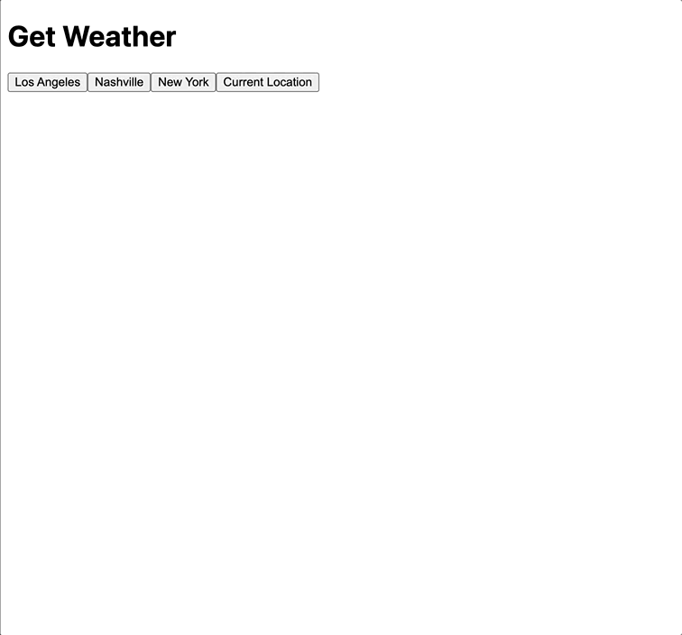

# Component Basics - Weather Component

This exercise has you building a simple component that shows the current weather of the location they select

_For this exercise build your component in the [Vue SFC Playground](https://play.vuejs.org/)_

## Notes

You can use the [Open Meteo API](https://open-meteo.com/en/docs) to fetch the current weather for these locations. The API URL will need to include the latitude and longitude coordinates for these locations so I've added them for you below. Your URLs that you will end up making fetch requests to will look something like this

https://api.open-meteo.com/v1/forecast?latitude=36.16&longitude=-86.78&current_weather=true&temperature_unit=fahrenheit

| City        | Latitude | Longitude |
| ----------- | -------- | --------- |
| Los Angeles | 34.05    | -118.24   |
| Nashville   | 36.16    | -86.78    |
| New York    | 40.71    | -74       |

**HINT**: The response object you'll get from the Open Meteo API will include a `weathercode` property. At the very bottom of the [documentation site](https://open-meteo.com/en/docs) you'll see how to use that code to find an actual human-readable description of the current weather

## Instructions

### Part 1

1. Give the user 3 buttons to click with these labels

- Los Angeles
- Nashville
- New York

2. When the user clicks a button, make a request to the Open Meteo API to fetch the current weather for that location. Render just the name of the location and the current temperature

### Part 2

1. Display text that says `Loading...` while your waiting for a response to come back from the API
1. Display the current weather conditions below the temperature. (See hint above about using the `weathercode`)

### Part 3

1. Give the user a 4th button labeled "Current Location". When clicked it should attempt to get the user's current location and fetch their weather. **HINT**: To get the user's current coordinates you can use the [getCurrentPosition](https://developer.mozilla.org/en-US/docs/Web/API/Geolocation/getCurrentPosition) function
