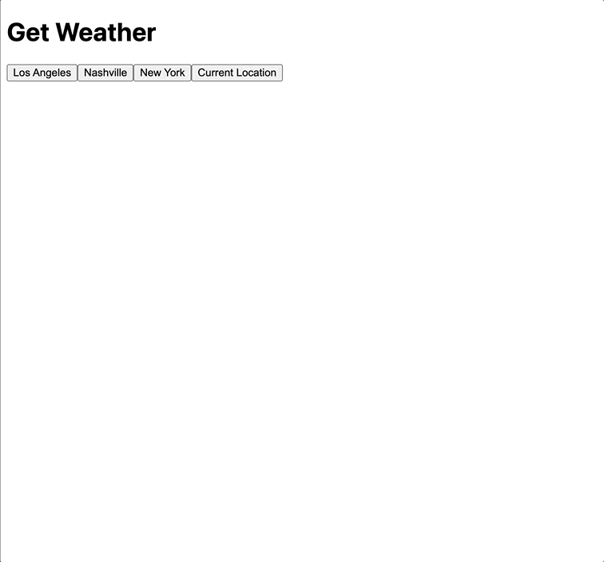

# Component Basics - Weather Component

This exercise has you building a simple component that shows the current weather of the location they select



_For this exercise build your component in the [Vue SFC Playground](https://play.vuejs.org/)_

## Notes

You can use the [Open Meteo API](https://open-meteo.com/en/docs) to fetch the current weather for these locations. The API URL will need to include the latitude and longitude coordinates for these locations so I've added them for you below. Your URLs that you will end up making fetch requests to will look something like this

https://api.open-meteo.com/v1/forecast?latitude=36.16&longitude=-86.78&current_weather=true&temperature_unit=fahrenheit

| City        | Latitude | Longitude |
| ----------- | -------- | --------- |
| Los Angeles | 34.05    | -118.24   |
| Nashville   | 36.16    | -86.78    |
| New York    | 40.71    | -74       |

**HINT**: The response object you'll get from the Open Meteo API will include a `weathercode` property. At the very bottom of the [documentation site](https://open-meteo.com/en/docs) you'll see how to use that code to find an actual human-readable description of the current weather

## Instructions

### Part 1

1. Give the user 3 buttons to click with these labels

- Los Angeles
- Nashville
- New York

2. When the user clicks a button, make a request to the Open Meteo API to fetch the current weather for that location. Render just the name of the location and the current temperature

### Part 2

1. Display text that says `Loading...` while your waiting for a response to come back from the API
1. Display the current weather conditions below the temperature. (See hint above about using the `weathercode`)

### Part 3

1. Give the user a 4th button labeled "Current Location". When clicked it should attempt to get the user's current location and fetch their weather. **HINT**: To get the user's current coordinates you can use the [getCurrentPosition](https://developer.mozilla.org/en-US/docs/Web/API/Geolocation/getCurrentPosition) function

# Code by Numbers

### Part 1

1. Inside the script section add a variable called `cities` which should be an object with 3 keys--`la`, `nashville`, and `nyc`. The values for each of these should also be an object with keys for `name`, `lat` and `lon`. It should look something like this

```js
const cities = {
  nashville: { name: "Nashville", lat: 36.16, lon: -86.78 },
  // la...
  /// nyc...
};
```

2. Import the `ref` function from vue, create a ref variable called `selectedLocation`, and give it an initial value of `null`
3. Add the 3 buttons to the template for LA, Nashville, and NYC
4. In your script create a function called `selectLocation` which accepts a single argument named `city`. (The `city` argument is meant to be a string & one of the keys to the `cities` object--e.g. "la", "nashville", or "nyc"). Inside the `selectLocation`, set the value of the `selectedLocation` variable to `cities[city]`. Bind this function to each of the buttons' click event, e.g.

```html
<button @click="selectLocation('nashville')"></button>
```

5. In the template add a header element below the buttons that shows the name of the selected location. Because `selectedLocation` will initially be `null`, add a `v-if` on the header element to make sure it only renders if `selectedLocation` isn't null
6. Inside the script, create another `ref` variable named `weatherResponse` and give it an initial value of `null`
7. Update the `selectLocation` function so that after it updates the `selectedLocation` it makes a fetch call to the weather API using the coordinates of the newly selected location. Set the `weatherResponse` to the response that comes back from the API.
8. Add a `div` element towards the bottom of the template to display the temperature in the `weatherResponse`. Remember that `weatherResponse` starts off as `null` so add a `v-if` tag on the div to make sure it is only rendered if `weatherResponse` isn't null

### Part 2

1. Create a new `ref` variable named `isLoading` and initialize it to `false`
2. Inside the `selectLocation` function set the value of `isLoading` to `true` just before the fetch request. Set it back to `false` after the API response comes back.
3. Inside the template add a `<div>` element just below the buttons with a `v-if` on it to show the "Loading..." text if `isLoading` is true. Then wrap everything below it (the location name and current temp) in a `v-else` so that it's hidden while the request is still in flight.
4. Create a new `ref` variable named `currentCondition` and initialize it to `null`. This will eventually be used to hold a string value like "Clear sky", "Partly cloudy", etc.
5. Create a function called `getConditionDescription` which accepts a `weatherCode` parameter. Look at the API documentation site where it says "WMO Weather interpretation codes (WW)" to see how certain codes map to certain descriptions. Using either a `switch` statement or a bunch of `if/else` statements, have the `getConditionDescription` function return the appropriate string based on the weather code that gets passed in.
6. Update the `selectLocation` function to call the `getConditionDescription` once the API response is returned and use it to set`currentCondition`

### Part 3

1. Add a new function to your script called `getCurrentLocationWeather` weather. It shouldn't take any parameters. Use the the `getCurrentPosition` function to get the user's coordinates. Once you have the user's coords, set the `selectedLocation` to something like this

```js
selectedLocation.value = {
  name: 'Current Location',
  lat: // the user's latitude you found
  lon: // the user's longitude you found
}
```

2. Make the API request and handle in the same way as before
3. Add a new button to the template for "Current Location" and bind the `getCurrentLocationWeather` to its click event.
4. Refactor as needed. `getCurrentLocationWeather` and `selectLocation` may have a lot of duplicate code, so feel free to make the code more DRY.
